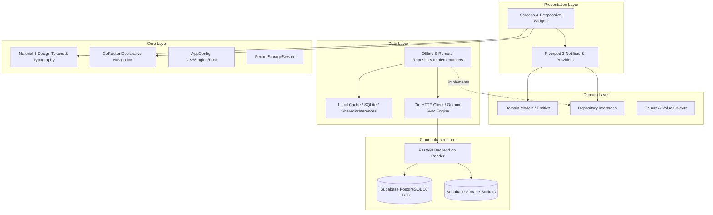

# FlowSpace Architecture Documentation

## 1. System Overview

FlowSpace is built as a production-ready, cross-platform mobile scheduling and productivity workstation. It merges block-based document authoring (Notion-style), rich calendar scheduling (Google Calendar-style), task and subtask execution (Todoist-style), local/push reminders, project tracking, and workspace collaboration into a unified Flutter client.

The architecture strictly adheres to **Clean Architecture** principles and **Feature-First** modular organization, powered by **Riverpod 3.x** state containers, an **Offline-First** repository layer with a local event outbox, a **FastAPI** backend deployed to **Render**, a managed **Supabase** PostgreSQL database with Row-Level Security, and an adaptive UI system supporting phones, tablets, and desktop form factors.

---

## 2. High-Level Architectural Layers

The codebase is organized into four concentric architectural layers:



### 2.1 Domain Layer (`lib/features/<feature>/domain/`)
- **Entities**: Pure Dart immutable classes (e.g., `Task`, `CalendarEvent`, `NotePage`, `EditorBlock`, `Project`, `Reminder`, `Category`, `User`, `Workspace`). They contain business logic, copy methods (`copyWith`), JSON serialization, and factory constructors.
- **Repository Contracts**: Abstract interfaces (e.g., `TaskRepository`, `CalendarRepository`, `NotesRepository`) defining required async operations without coupling to any storage technology or network protocol.
- **Independence**: The Domain layer has zero dependencies on Flutter UI frameworks or third-party storage plugins.

### 2.2 Data Layer (`lib/features/<feature>/data/`)
- **Repository Implementations**: Implement domain contracts (e.g., `OfflineTaskRepository`, `OfflineCalendarRepository`, `OfflineNotesRepository`).
- **Data Persistence**: Offline-first repositories maintain reactive in-memory stores pre-seeded with realistic productivity data, integrated with `SharedPreferences` and local SQLite stores.
- **Network Layer**: `DioClient` (`lib/core/network/dio_client.dart`) provides structured HTTP networking with authentication interceptors, base URL switching, error mapping, and token refresh.
- **Sync Outbox**: `SyncQueueManager` (`lib/core/network/sync_queue_manager.dart`) queues local mutation events when offline, dispatching batch synchronization payloads to `POST /api/v1/sync/batch` when network connectivity is re-established.

### 2.3 Presentation Layer (`lib/features/<feature>/presentation/`)
- **State Management**: Implemented using Riverpod 3's `Notifier<T>` and `NotifierProvider<NotifierClass, T>` pattern.
  - Providers manage state transitions, optimistic UI updates, filter/search mutations, and error states.
  - Safe lifecycle bootstrapping via microtasks ensures state is ready prior to initial repository queries.
- **UI Components & Screens**:
  - Modular, reusable widgets (`TaskTile`, `BlockItemWidget`, `SlashCommandPalette`, `WeekViewWidget`, `MonthViewWidget`, etc.).
  - Responsive scaffolds (`AdaptiveScaffold`) providing bottom navigation bars on compact screens (<600dp) and navigation rails on tablets/desktops (>=600dp).

### 2.4 Core Layer (`lib/core/`)
- **Theme**: HSL-tailored Material 3 palette (`AppColors`), curated Google Font typography (`AppTypography`), and unified Light/Dark theme specifications (`AppTheme`).
- **Config**: `AppConfig` supporting Development, Staging, and Production profiles.
- **Storage**: `SecureStorageService` for encrypted JWT tokens and user session persistence.
- **Navigation**: `GoRouter` declarative configuration with transition animations, modal sheets, and deep-link readiness.

---

## 3. Directory Structure

```
lib/
├── app.dart                                # MaterialApp.router entrypoint with ThemeMode binding
├── main.dart                               # main() entrypoint wrapped with ProviderScope
├── core/
│   ├── config/
│   │   └── app_config.dart                 # Dynamic runtime environment configuration
│   ├── constants/
│   │   └── sample_data.dart                # Realistic seed datasets for all domains
│   ├── errors/
│   │   └── failures.dart                   # Domain failure hierarchy
│   ├── network/
│   │   ├── api_client.dart                 # Endpoint contracts and SyncQueueItem
│   │   ├── dio_client.dart                 # Production Dio HTTP client with interceptors
│   │   └── sync_queue_manager.dart         # Offline outbox queue manager
│   ├── routing/
│   │   └── app_router.dart                 # GoRouter route definitions & sub-routes
│   ├── storage/
│   │   ├── attachment_model.dart           # File attachment model
│   │   └── secure_storage_service.dart     # Secure token storage wrapper
│   ├── theme/
│   │   ├── app_colors.dart                 # Hex color tokens (primary, surface, accents)
│   │   ├── app_theme.dart                  # Material 3 light/dark ThemeData
│   │   └── app_typography.dart             # Inter / Plus Jakarta Sans text styles
│   ├── utils/
│   │   └── responsive_layout.dart          # ResponsiveBreakpoints (compact, medium, expanded)
│   └── widgets/
│       └── adaptive_scaffold.dart          # Responsive navigation shell (Bar vs. Rail)
└── features/
    ├── auth/                               # Login, Signup, Onboarding, First-run
    ├── calendar/                           # Month, Week (overlapping), Day, Agenda, Event Editor
    ├── home/                               # Productivity Dashboard, Ring, Today's Timeline
    ├── notes/                              # Notion Block Editor, Slash Commands, Subpages
    ├── projects/                           # Project Cards, Progress, Filtered Tasks
    ├── reminders/                          # Reminder List, Snooze Presets, Recurrence
    ├── search/                             # Multi-entity Global Search
    ├── settings/                           # Settings, Appearance, Sync Outbox, Analytics
    └── tasks/                              # Task List, Subtasks, Priority, Filter Sheets
```

---

## 4. Key Engineering Subsystems

### 4.1 Notion-Style Block Document Editor
The document editor (`lib/features/notes/presentation/screens/note_editor_screen.dart`) models documents as an ordered collection of discrete `EditorBlock` entities:
- **Block Types**: Paragraph, Heading 1, Heading 2, Heading 3, Bulleted List, Numbered List, To-Do Checkbox, Quote, Code Snippet, Divider, Callout, and Subpage Link.
- **Slash Command Trigger**: Typing `/` at the start of a block summons the floating modal palette (`SlashCommandPalette`), allowing instant transformation into any block type.
- **Markdown Prefix Detection**: Real-time inline conversion detects prefixes (`# `, `## `, `### `, `[] `, `- `, `1. `, `> `) and converts standard paragraphs into rich blocks automatically.
- **Enter & Backspace Keyboard Mechanics**:
  - Pressing Enter splits or inserts a new block immediately below the active block.
  - Pressing Backspace on an empty block reverts it to a paragraph or deletes it, shifting focus upwards.

### 4.2 Dynamic Calendar Timeline & Collision Clustering
The Week and Day calendar views render events on a continuous 24-hour vertical timeline:
- **Vertical Positioning**:
  $$\text{Top} = \left(\text{Hour} + \frac{\text{Minute}}{60}\right) \times \text{HourHeight}$$
  $$\text{Height} = \frac{\text{Duration in Minutes}}{60} \times \text{HourHeight}$$
- **Overlap & Collision Resolution**:
  The timeline layout groups overlapping events into contiguous clusters. Each event in a cluster is assigned a column index ($i$) out of total overlapping columns ($N$), positioning it at:
  $$\text{Left} = \frac{i}{N} \times \text{AvailableWidth}, \quad \text{Width} = \frac{\text{AvailableWidth}}{N}$$

### 4.3 Offline-First Architecture & Outbox Synchronization
- All write operations update local state synchronously and enqueue a `SyncQueueItem` in the local outbox.
- When an internet connection is verified:
  1. The outbox payload is serialized to JSON (`POST /api/v1/sync/batch`).
  2. The server processes mutations within a single database transaction.
  3. Responses include updated server timestamps and conflict resolution hashes (Last-Write-Wins with client idempotency keys).

---

## 5. Cloud Backend & Supabase Integration

- **FastAPI Container**: Runs Python 3.11 with Uvicorn ASGI on Render's free tier. Exposes unauthenticated `/health` probe and documented REST endpoints under `/api/v1`.
- **Supabase Database**: PostgreSQL 16+ with Row-Level Security (RLS) enforcing multi-tenant isolation through `workspace_members`. No user can read or alter another user's private data.
- **Supabase Storage**: S3-compatible object buckets for user avatars, note images, and project attachments with authenticated access policies.
- **CI/CD Pipelines**: Dual GitHub Actions workflows (`flutter.yml` and `backend.yml`) automating linting, testing, Docker builds, Flutter Web builds, and Android debug APK generation.
