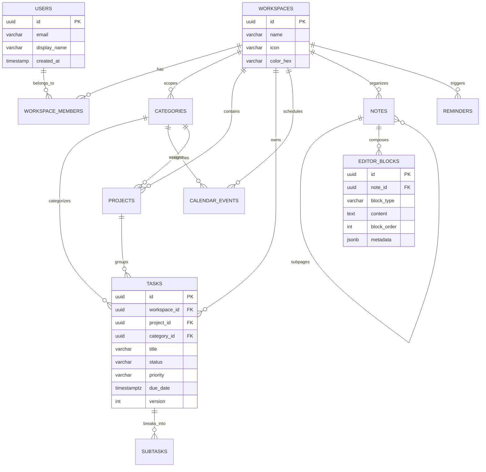

# FlowSpace Database Schema Specification

This document details the relational database architecture for FlowSpace, engineered for **PostgreSQL 16+** with high-throughput indexing, JSONB block structures, and an offline synchronization audit trail.

---

## 1. Entity-Relationship Architecture



---

## 2. PostgreSQL DDL Schema

```sql
-- Enable necessary extensions
CREATE EXTENSION IF NOT EXISTS "uuid-ossp";
CREATE EXTENSION IF NOT EXISTS "pg_trgm";

-- ----------------------------------------------------
-- 1. USERS TABLE
-- ----------------------------------------------------
CREATE TABLE users (
    id UUID PRIMARY KEY DEFAULT uuid_generate_v4(),
    email VARCHAR(255) NOT NULL UNIQUE,
    password_hash VARCHAR(255) NOT NULL,
    display_name VARCHAR(100) NOT NULL,
    avatar_url TEXT,
    created_at TIMESTAMPTZ NOT NULL DEFAULT NOW(),
    updated_at TIMESTAMPTZ NOT NULL DEFAULT NOW()
);

-- ----------------------------------------------------
-- 2. WORKSPACES TABLE
-- ----------------------------------------------------
CREATE TABLE workspaces (
    id UUID PRIMARY KEY DEFAULT uuid_generate_v4(),
    owner_id UUID NOT NULL REFERENCES users(id) ON DELETE CASCADE,
    name VARCHAR(100) NOT NULL,
    icon VARCHAR(16) DEFAULT '🚀',
    color_hex VARCHAR(7) DEFAULT '#4F46E5',
    created_at TIMESTAMPTZ NOT NULL DEFAULT NOW(),
    updated_at TIMESTAMPTZ NOT NULL DEFAULT NOW()
);

-- ----------------------------------------------------
-- 3. WORKSPACE MEMBERS TABLE
-- ----------------------------------------------------
CREATE TABLE workspace_members (
    id UUID PRIMARY KEY DEFAULT uuid_generate_v4(),
    workspace_id UUID NOT NULL REFERENCES workspaces(id) ON DELETE CASCADE,
    user_id UUID NOT NULL REFERENCES users(id) ON DELETE CASCADE,
    role VARCHAR(20) NOT NULL DEFAULT 'member' CHECK (role IN ('owner', 'admin', 'member', 'viewer')),
    joined_at TIMESTAMPTZ NOT NULL DEFAULT NOW(),
    CONSTRAINT uq_workspace_user UNIQUE (workspace_id, user_id)
);

-- ----------------------------------------------------
-- 4. CATEGORIES TABLE
-- ----------------------------------------------------
CREATE TABLE categories (
    id UUID PRIMARY KEY DEFAULT uuid_generate_v4(),
    workspace_id UUID NOT NULL REFERENCES workspaces(id) ON DELETE CASCADE,
    name VARCHAR(50) NOT NULL,
    color_hex VARCHAR(7) NOT NULL,
    icon VARCHAR(50) NOT NULL,
    created_at TIMESTAMPTZ NOT NULL DEFAULT NOW()
);

-- ----------------------------------------------------
-- 5. PROJECTS TABLE
-- ----------------------------------------------------
CREATE TABLE projects (
    id UUID PRIMARY KEY DEFAULT uuid_generate_v4(),
    workspace_id UUID NOT NULL REFERENCES workspaces(id) ON DELETE CASCADE,
    category_id UUID REFERENCES categories(id) ON DELETE SET NULL,
    name VARCHAR(150) NOT NULL,
    description TEXT,
    icon VARCHAR(16) DEFAULT '📁',
    color_hex VARCHAR(7) NOT NULL,
    status VARCHAR(20) NOT NULL DEFAULT 'active' CHECK (status IN ('active', 'completed', 'archived')),
    start_date TIMESTAMPTZ,
    target_date TIMESTAMPTZ,
    version INT NOT NULL DEFAULT 1,
    created_at TIMESTAMPTZ NOT NULL DEFAULT NOW(),
    updated_at TIMESTAMPTZ NOT NULL DEFAULT NOW()
);

-- ----------------------------------------------------
-- 6. TASKS TABLE
-- ----------------------------------------------------
CREATE TABLE tasks (
    id UUID PRIMARY KEY DEFAULT uuid_generate_v4(),
    workspace_id UUID NOT NULL REFERENCES workspaces(id) ON DELETE CASCADE,
    project_id UUID REFERENCES projects(id) ON DELETE SET NULL,
    category_id UUID REFERENCES categories(id) ON DELETE SET NULL,
    title VARCHAR(255) NOT NULL,
    description TEXT,
    status VARCHAR(20) NOT NULL DEFAULT 'todo' CHECK (status IN ('todo', 'in_progress', 'completed', 'cancelled')),
    priority VARCHAR(20) NOT NULL DEFAULT 'none' CHECK (priority IN ('urgent', 'high', 'medium', 'low', 'none')),
    due_date TIMESTAMPTZ,
    completed_at TIMESTAMPTZ,
    is_recurring BOOLEAN NOT NULL DEFAULT FALSE,
    recurrence_rule VARCHAR(100),
    version INT NOT NULL DEFAULT 1,
    created_at TIMESTAMPTZ NOT NULL DEFAULT NOW(),
    updated_at TIMESTAMPTZ NOT NULL DEFAULT NOW()
);

-- ----------------------------------------------------
-- 7. SUBTASKS TABLE
-- ----------------------------------------------------
CREATE TABLE subtasks (
    id UUID PRIMARY KEY DEFAULT uuid_generate_v4(),
    task_id UUID NOT NULL REFERENCES tasks(id) ON DELETE CASCADE,
    title VARCHAR(255) NOT NULL,
    is_completed BOOLEAN NOT NULL DEFAULT FALSE,
    subtask_order INT NOT NULL DEFAULT 0,
    created_at TIMESTAMPTZ NOT NULL DEFAULT NOW()
);

-- ----------------------------------------------------
-- 8. CALENDAR EVENTS TABLE
-- ----------------------------------------------------
CREATE TABLE calendar_events (
    id UUID PRIMARY KEY DEFAULT uuid_generate_v4(),
    workspace_id UUID NOT NULL REFERENCES workspaces(id) ON DELETE CASCADE,
    category_id UUID REFERENCES categories(id) ON DELETE SET NULL,
    title VARCHAR(255) NOT NULL,
    description TEXT,
    start_time TIMESTAMPTZ NOT NULL,
    end_time TIMESTAMPTZ NOT NULL,
    is_all_day BOOLEAN NOT NULL DEFAULT FALSE,
    location VARCHAR(255),
    color_hex VARCHAR(7) NOT NULL,
    recurrence_rule VARCHAR(100),
    version INT NOT NULL DEFAULT 1,
    created_at TIMESTAMPTZ NOT NULL DEFAULT NOW(),
    updated_at TIMESTAMPTZ NOT NULL DEFAULT NOW(),
    CONSTRAINT chk_event_dates CHECK (end_time >= start_time)
);

-- ----------------------------------------------------
-- 9. NOTES & WIKIS TABLE
-- ----------------------------------------------------
CREATE TABLE notes (
    id UUID PRIMARY KEY DEFAULT uuid_generate_v4(),
    workspace_id UUID NOT NULL REFERENCES workspaces(id) ON DELETE CASCADE,
    parent_id UUID REFERENCES notes(id) ON DELETE CASCADE,
    title VARCHAR(255) NOT NULL,
    icon VARCHAR(16) DEFAULT '📄',
    cover_image_url TEXT,
    is_pinned BOOLEAN NOT NULL DEFAULT FALSE,
    is_archived BOOLEAN NOT NULL DEFAULT FALSE,
    version INT NOT NULL DEFAULT 1,
    created_at TIMESTAMPTZ NOT NULL DEFAULT NOW(),
    updated_at TIMESTAMPTZ NOT NULL DEFAULT NOW()
);

-- ----------------------------------------------------
-- 10. EDITOR BLOCKS TABLE (Notion Hierarchy)
-- ----------------------------------------------------
CREATE TABLE editor_blocks (
    id UUID PRIMARY KEY DEFAULT uuid_generate_v4(),
    note_id UUID NOT NULL REFERENCES notes(id) ON DELETE CASCADE,
    block_type VARCHAR(50) NOT NULL CHECK (block_type IN (
        'paragraph', 'heading1', 'heading2', 'heading3',
        'bulleted_list', 'numbered_list', 'todo',
        'quote', 'code', 'divider', 'callout', 'subpage_link'
    )),
    content TEXT NOT NULL DEFAULT '',
    block_order INT NOT NULL DEFAULT 0,
    metadata JSONB NOT NULL DEFAULT '{}'::jsonb,
    created_at TIMESTAMPTZ NOT NULL DEFAULT NOW(),
    updated_at TIMESTAMPTZ NOT NULL DEFAULT NOW()
);

-- ----------------------------------------------------
-- 11. REMINDERS TABLE
-- ----------------------------------------------------
CREATE TABLE reminders (
    id UUID PRIMARY KEY DEFAULT uuid_generate_v4(),
    workspace_id UUID NOT NULL REFERENCES workspaces(id) ON DELETE CASCADE,
    title VARCHAR(255) NOT NULL,
    notes TEXT,
    remind_at TIMESTAMPTZ NOT NULL,
    is_completed BOOLEAN NOT NULL DEFAULT FALSE,
    is_snoozed BOOLEAN NOT NULL DEFAULT FALSE,
    snooze_until TIMESTAMPTZ,
    recurrence_interval VARCHAR(20) DEFAULT 'none',
    version INT NOT NULL DEFAULT 1,
    created_at TIMESTAMPTZ NOT NULL DEFAULT NOW(),
    updated_at TIMESTAMPTZ NOT NULL DEFAULT NOW()
);
```

---

## 3. High-Performance Indexing Strategy

```sql
-- Composite indexes for workspace partitioning
CREATE INDEX idx_tasks_ws_status_due ON tasks(workspace_id, status, due_date);
CREATE INDEX idx_tasks_ws_project ON tasks(workspace_id, project_id);
CREATE INDEX idx_events_ws_time ON calendar_events(workspace_id, start_time, end_time);
CREATE INDEX idx_notes_ws_parent ON notes(workspace_id, parent_id);
CREATE INDEX idx_blocks_note_order ON editor_blocks(note_id, block_order ASC);
CREATE INDEX idx_reminders_ws_time ON reminders(workspace_id, remind_at) WHERE is_completed = FALSE;

-- Full-text search GIN indexes for global search
CREATE INDEX idx_tasks_title_trgm ON tasks USING gin (title gin_trgm_ops);
CREATE INDEX idx_notes_title_trgm ON notes USING gin (title gin_trgm_ops);
CREATE INDEX idx_blocks_content_trgm ON editor_blocks USING gin (content gin_trgm_ops);
```

---

## 4. Automatic Timestamp Update Triggers

```sql
CREATE OR REPLACE FUNCTION trigger_set_timestamp()
RETURNS TRIGGER AS $$
BEGIN
  NEW.updated_at = NOW();
  NEW.version = OLD.version + 1;
  RETURN NEW;
END;
$$ LANGUAGE plpgsql;

CREATE TRIGGER set_timestamp_tasks
BEFORE UPDATE ON tasks
FOR EACH ROW EXECUTE FUNCTION trigger_set_timestamp();

CREATE TRIGGER set_timestamp_notes
BEFORE UPDATE ON notes
FOR EACH ROW EXECUTE FUNCTION trigger_set_timestamp();

CREATE TRIGGER set_timestamp_calendar_events
BEFORE UPDATE ON calendar_events
FOR EACH ROW EXECUTE FUNCTION trigger_set_timestamp();

CREATE TRIGGER set_timestamp_editor_blocks
BEFORE UPDATE ON editor_blocks
FOR EACH ROW EXECUTE FUNCTION trigger_set_timestamp();
```
